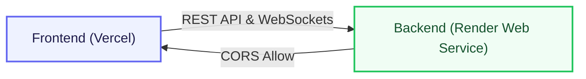

# VedaAI Deployment Guide: Vercel + Render Hybrid Setup

This guide details how to deploy the VedaAI monorepo to production using a hybrid hosting model:
- **Backend (API, Sockets, and Queue Workers):** Deployed to **Render** as a Web Service.
- **Frontend (Next.js Dashboard):** Deployed to **Vercel** as a Next.js Serverless Project.

---

## Architecture Overview

---

## 1. Backend Deployment (Render)

Deploy the backend as a Node.js Web Service on Render. Since it is part of a monorepo, we can either deploy using the monorepo root settings or set the root directory to `backend`. The recommended and tested approach is using monorepo root settings:

### Service Settings
* **Service Type:** Web Service
* **Runtime:** Node
* **Build Command:** `npm install --prefix backend --production=false && npm run build --prefix backend`
* **Start Command:** `npm run start --prefix backend`
* **Health Check Path:** `/api/health`

### Environment Variables
Under the **Environment** tab, set the following variables:

| Variable | Value / Notes |
| :--- | :--- |
| `NODE_VERSION` | `20` |
| `NODE_ENV` | `production` |
| `PORT` | *(Render injects this automatically)* |
| `FRONTEND_URL` | `https://ai-assessment-maker.vercel.app` *(Your Vercel app domain)* |
| `COOKIE_DOMAIN` | *(Leave empty unless using custom domain cookie sharing)* |
| `MONGO_URI` | `mongodb+srv://<username>:<password>@<cluster>.mongodb.net/<database>` |
| `UPSTASH_REDIS_URL` | `redis://default:<password>@<endpoint>:<port>` |
| `GEMINI_API_KEY` | *(Your Google Gemini API Key)* |
| `CLOUDINARY_CLOUD_NAME` | *(Your Cloudinary Cloud Name)* |
| `CLOUDINARY_API_KEY` | *(Your Cloudinary API Key)* |
| `CLOUDINARY_API_SECRET` | *(Your Cloudinary API Secret)* |
| `JWT_SECRET` | *(A secure random string for signing JWT tokens)* |
| `JWT_EXPIRY` | `7d` |

---

## 2. Frontend Deployment (Vercel)

Deploy the frontend dashboard to Vercel. Vercel automatically detects Next.js configurations.

### Import Project
1. Go to the Vercel Dashboard and click **Add New** > **Project**.
2. Import your GitHub repository: `sachin9919/AI-Assessment-maker`.
3. In the project settings, configure the following:

### Project Settings
* **Framework Preset:** `Next.js`
* **Root Directory:** `frontend`
* **Node.js Version:** `20.x` *(configured under Project Settings -> General)*

### Environment Variables
Expand the **Environment Variables** section and add:

| Variable | Value |
| :--- | :--- |
| `NEXT_PUBLIC_API_URL` | `https://vedaai-backend-dot8.onrender.com` *(Your Render backend URL)* |
| `NEXT_PUBLIC_BACKEND_URL` | `https://vedaai-backend-dot8.onrender.com` |
| `BACKEND_URL` | `https://vedaai-backend-dot8.onrender.com` |

Click **Deploy**. Vercel will build the frontend and serve it at a domain like `https://ai-assessment-maker.vercel.app`.

---

## 3. Verify the Deployment

Once both services are successfully built and live:

1. **Verify CORS Settings:** Check that your Render environment variable `FRONTEND_URL` exactly matches your Vercel deployment URL (e.g. `https://ai-assessment-maker.vercel.app`).
2. **Access the Web Portal:** Open your Vercel App link (`https://ai-assessment-maker.vercel.app/login`).
3. **Register/Login:** Sign up a new user account.
4. **Create an Assessment:** Submit the creator wizard and check the live progress bar (powered by Socket.IO streaming from the Render worker).
5. **A4 PDF Export:** View the generated paper, trigger a reload or edit if needed, and download the high-fidelity A4 PDF.

---

## Troubleshooting & Critical Details

### ⚠️ WebSocket Connections (Socket.IO)
- Socket.IO requires matching domains. Ensure `NEXT_PUBLIC_BACKEND_URL` in Vercel points to the exact Render backend hostname.
- Ensure backend CORS middleware dynamically allows the exact Vercel frontend origin.

### ⚠️ Queue Worker & Redis
- In this single-process deployment, the BullMQ worker runs alongside the Express REST API.
- Ensure your Upstash Redis database is active and accepting connections, as all background assessment generation tasks depend on it.
