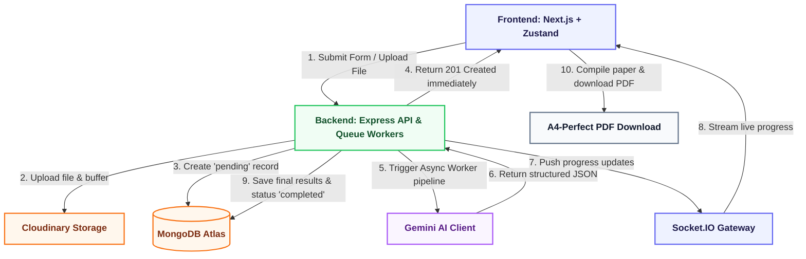

# 🎓 VedaAI — AI Assessment & Question Paper Creator

[](https://nextjs.org/)
[](https://www.typescriptlang.org/)
[](https://tailwindcss.com/)
[](https://nodejs.org/)
[](https://expressjs.com/)
[](https://www.mongodb.com/)
[](https://socket.io/)
[](https://aistudio.google.com/)

VedaAI is a premium, high-fidelity Full-Stack Web Application built for modern educators to design, generate, and customize AI-driven school-exam question papers. It seamlessly combines highly structured form inputs (supporting optional file uploads for contextual reference) with the **Google Gemini API** to generate rich, syllabus-aligned assessments in real-time.

With interactive background processing, live progress tracking via WebSockets (Socket.IO), and an elegant, school-exam-styled output interface featuring A4-perfect PDF export, VedaAI delivers an elite experience inspired directly by professional Figma designs.

🚀 **Live Deployment:** [VedaAI Web Application Portal](https://ai-assessment-maker.vercel.app/login)  
⚡ **Production Backend API:** [VedaAI Backend Service Status](https://vedaai-backend-dot8.onrender.com/api/health)

---

## System Architecture

VedaAI is designed as a modular, full-stack monorepo featuring high separation of concerns:



### Key Architectural Flow:

1. **Instant Feedback:** When a teacher submits the generation form, the server initializes the assessment in a `pending` state and returns a `201` status immediately, shielding the frontend from browser connection timeouts during LLM inference.
2. **WebSocket Synchronization:** The frontend connects to the socket gateway and automatically joins a room mapped to the `assignmentId`. As the server steps through file reading, AI prompt creation, parsing, and database saving, it broadcasts progress messages to keep the user engaged.
3. **Cloudinary Asset Storage:** Rather than storing heavy documents in MongoDB, upload streams are piped directly to Cloudinary. The secure file URL is cached and sent to Gemini as a contextual attachment.

---

## Key Features & Highlights

### 1. Highly-Validated Assignment Designer
- **Wizard Builder Interface:** Fully structured wizard UI containing validation rules to prevent empty inputs, negative question counts, or invalid point allocations.
- **Reference Document Uploads:** Support for uploading study materials (PDFs/Text) processed through **Multer** and securely cached via **Cloudinary**, serving as an explicit contextual anchor for Gemini's prompt generator.
- **Granular Adjustments:** Precise configuration for due dates, difficulty distribution, specific question types (MCQ, Short Answers, Long Answers, True/False), and custom guidelines.

### 2. Real-Time Progress Streamer
- **Background Queue Workers:** Background workers handle AI generations asynchronously via **BullMQ** + **Redis**, avoiding bottleneck blocks on HTTP cycles.
- **Socket Rooms Status Broadcast:** Real-time socket rooms stream specific statuses: `Reading document...`, `Planning assignment layout...`, `Generating content...`, `Saving new assignment...`.
- **Asymptotic Progress Loader:** The client animates an interactive progress bar using an asymptotic loading function that elegantly transitions to `100%` on `job:completed`.

### 3. Structured School-Exam Visualizer
- **Student ID Slip:** Generates realistic student registration slots (Name, Roll Number, Class/Section).
- **Syllabus Sections:** Groups questions perfectly by dynamic Sections (e.g., *Section A: Multiple Choice Questions*, *Section B: Short Answer Questions*).
- **Points & Difficulty Badges:** Features visual badges indicating difficulty levels (Easy in green, Moderate in yellow, Hard in red) alongside dedicated points allocation.
- **Pedagogical Accords:** Complete educational Answer Key and Explanation Accordion at the end of the paper, detailing the correct answers alongside pedagogical rationales.

### 4. High-Fidelity A4 PDF Generator
To solve typical browser printing failures (where dynamic Tailwind v4 elements are clipped, page dimensions are misaligned, or background tag overlays fail to render), VedaAI utilizes a custom visual rasterization pipeline:
1. **Targeted Reference:** Binds a React `useRef` hook directly onto the "Master Paper Container."
2. **Lossless Compilation:** Utilizes `html-to-image` to compile the visual container into a high-density, high-quality PNG data URL.
3. **Canvas Proportional Scaling:** Instantiates a standard `jsPDF` canvas in `a4` portrait mode ($210mm \times 297mm$).
4. **Perfect Page Fit:** Automatically calculates the aspect ratio and proportionally maps the high-resolution raster image on the printable canvas. This guarantees that your PDF exactly mirrors the high-end design, completely safe from CSS layout breaks or clipping.

---

## Future Enhancements
* **BullMQ queues & Redis Caching:** Scaling background tasks with standalone workers using Redis for strict job isolation.
* **Interactive Editor:** Allows teachers to click, edit, delete, or regenerate individual questions on the fly before exporting.
* **Student Mode:** Allow students to join a room, attempt the exam, and have their answers graded automatically using Gemini.

---

## Project Structure

```
├── backend/            # Express REST API & Background Queue Workers
├── frontend/           # Next.js Dashboard Client Web Application
├── shared/             # Common schema definitions and TypeScript interfaces
├── render.yaml         # Infrastructure deployment blueprint for Render services
└── DEPLOY_GUIDE.md     # Production hosting guide (Vercel + Render)
```

---

## Local Development Setup

### 1. Prerequisites
- Node.js (v20+)
- MongoDB Atlas cluster
- Upstash Redis database
- Google Gemini API credentials
- Cloudinary developer account

### 2. Backend Configuration
Navigate to the `backend` folder, install dependencies, and create a `.env` file:
```bash
cd backend
npm install
```
`.env` contents:
```env
PORT=5000
NODE_ENV=development
FRONTEND_URL=http://localhost:3000
MONGO_URI=your_mongodb_atlas_uri
UPSTASH_REDIS_URL=your_upstash_redis_uri
GEMINI_API_KEY=your_gemini_api_key
CLOUDINARY_CLOUD_NAME=your_cloudinary_name
CLOUDINARY_API_KEY=your_cloudinary_key
CLOUDINARY_API_SECRET=your_cloudinary_secret
JWT_SECRET=your_jwt_secret_phrase
JWT_EXPIRY=7d
```
Start the development API:
```bash
npm run dev
```

### 3. Frontend Configuration
Navigate to the `frontend` folder, install dependencies, and create a `.env.local` file:
```bash
cd frontend
npm install
```
`.env.local` contents:
```env
NEXT_PUBLIC_API_URL=http://localhost:5000
NEXT_PUBLIC_BACKEND_URL=http://localhost:5000
BACKEND_URL=http://localhost:5000
```
Start the Next.js development client:
```bash
npm run dev
```
Access the application at `http://localhost:3000`.

---

## Production Deployment

This project is deployed across two platforms:
* **Frontend:** Deployed to **Vercel** as a Next.js Serverless Project.
* **Backend:** Deployed to **Render** as a Node.js Web Service.

For detailed steps on setting up environment variables, CORS configuration, and triggering builds, read the [Vercel & Render Deployment Guide](DEPLOY_GUIDE.md).
